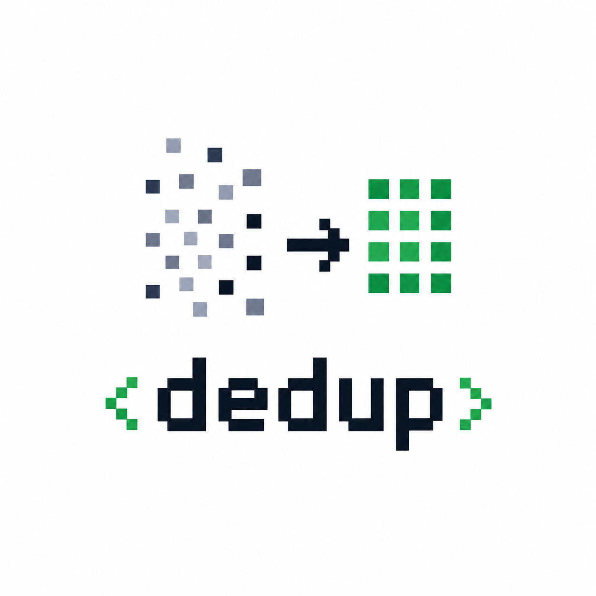

# dedup



Find duplicate and similar TypeScript type/interface declarations across a codebase — candidates for deduplication.

## Install

```
npm install
npm run build
```

## Usage

```
node dist/cli.js <dir> [<dir> ...] [--threshold 0.7]
```

- `<dir>` — one or more directories to scan (`.ts`/`.tsx`, recursive)
- `-t, --threshold` — similarity threshold, `0`–`1` (default `0.7`). `1` = identical only.

Example:

```
node dist/cli.js src --threshold 0.6
node dist/cli.js src packages/shared -t 0.8
```

## Output

Results are split into two sections:

- **EXACT DUPLICATES** — same fields, same types, same optionality. Safe to merge/alias immediately.
- **SIMILAR TYPES** — same shape but a field was renamed, added, removed, or made optional. Needs a refactor before merging.

Nested object-literal fields (e.g. `address: { street, city }`) are compared recursively and also reported as their own standalone candidates.

## Try it

```
node dist/cli.js examples
```

## MCP server

Exposes a `find_duplicates` tool over stdio so an LLM can pull the results and decide what to do with them.

```
npm run build
```

Tool input: `{ dirs: string[], threshold?: number }`. Returns `exactDuplicates` and `similarTypes` as JSON — same grouping as the CLI, no formatting/colors, meant for the model to read. Each call re-scans the directories fresh; no session state kept between calls.

Use `/absolute/path/to/dedup/dist/mcp-server.js` (replace with your actual path) in every config below.

### Claude Code

```
claude mcp add dedup -- node /absolute/path/to/dedup/dist/mcp-server.js
```

### Claude Desktop

Edit `claude_desktop_config.json` (Settings → Developer → Edit Config):

```json
{
  "mcpServers": {
    "dedup": {
      "command": "node",
      "args": ["/absolute/path/to/dedup/dist/mcp-server.js"]
    }
  }
}
```

### Codex CLI

```
codex mcp add dedup -- node /absolute/path/to/dedup/dist/mcp-server.js
```

Or in `~/.codex/config.toml`:

```toml
[mcp_servers.dedup]
command = "node"
args = ["/absolute/path/to/dedup/dist/mcp-server.js"]
```

### Cursor

`.cursor/mcp.json` (project) or `~/.cursor/mcp.json` (global):

```json
{
  "mcpServers": {
    "dedup": {
      "command": "node",
      "args": ["/absolute/path/to/dedup/dist/mcp-server.js"]
    }
  }
}
```

### Windsurf

`~/.codeium/windsurf/mcp_config.json`:

```json
{
  "mcpServers": {
    "dedup": {
      "command": "node",
      "args": ["/absolute/path/to/dedup/dist/mcp-server.js"]
    }
  }
}
```

### Cline / Roo Code / Kilo Code

All three read the same shape, via each extension's "MCP Servers" panel → "Configure MCP Servers" (opens `cline_mcp_settings.json` / `roo_mcp_settings.json` / `kilocode_mcp_settings.json`):

```json
{
  "mcpServers": {
    "dedup": {
      "command": "node",
      "args": ["/absolute/path/to/dedup/dist/mcp-server.js"]
    }
  }
}
```

### Gemini CLI

```
gemini mcp add dedup node /absolute/path/to/dedup/dist/mcp-server.js
```

Or in `~/.gemini/settings.json`:

```json
{
  "mcpServers": {
    "dedup": {
      "command": "node",
      "args": ["/absolute/path/to/dedup/dist/mcp-server.js"]
    }
  }
}
```

### VS Code (Copilot agent mode)

`.vscode/mcp.json`:

```json
{
  "servers": {
    "dedup": {
      "command": "node",
      "args": ["/absolute/path/to/dedup/dist/mcp-server.js"]
    }
  }
}
```

### Amazon Q Developer CLI

`~/.aws/amazonq/mcp.json`:

```json
{
  "mcpServers": {
    "dedup": {
      "command": "node",
      "args": ["/absolute/path/to/dedup/dist/mcp-server.js"]
    }
  }
}
```
